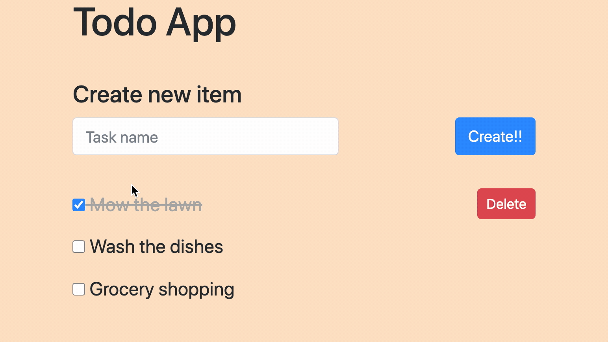

# To Do App

## Description

_Duration:_ Weekend project

This is a basic ToDo list, where a user make a checklist of things to do, and mark them off as they complete them.

In building this app, I practiced skills for full stack integration, connecting a jQuery-powered front-end through a node server to a SQL database.

## Screenshots

## Prerequisites

To run this app, you will need:

- Node.js
- Postgres

## Install

To run this application:

- Create a database in postgres called `weekend-to-do-app`
- Execute the SQL commands from `database.sql`
- Run `npm install` from the project root directory
- Run `npm start` to run the node server
- Open `http://localhost:3000` in your browser

## Usage

Write a todo item in the text box and click _Create!!_ to add a new item.
Click the checkbox next to the item to mark as complete.
Click the delete button to remove a task.

## Deploying to Heroku

See [HEROKU.md](./HEROKU.md).